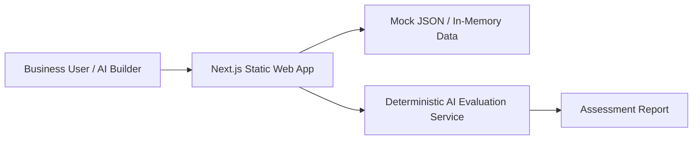
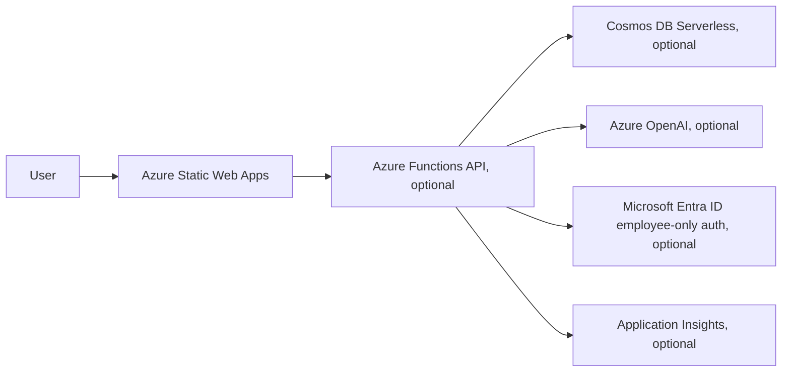

# System Design

## Overview

Marit should begin as a static-first Next.js app with mock data and deterministic AI evaluation. Azure Functions, Cosmos DB serverless, Microsoft Entra employee-only authentication, Bicep, Application Insights, and Azure OpenAI are extension points, not first-demo work.

## Initial Demo Architecture

## Future Azure Architecture

## Boundaries

### UI Layer

- Presents intake, dashboards, reports, and review flows.
- Handles simulated role switching for the demo.
- Uses localization resources for all user-facing strings.

### Data Layer

- Starts with mock JSON or in-memory fixtures.
- Exposes repository-style functions such as list business cases, get business case, save review, and list AI tools.
- Should be replaceable with Cosmos DB serverless later without changing UI code heavily.

### AI Evaluation Layer

- Starts as a deterministic mock service.
- Accepts a business case and available AI tools.
- Returns an assessment report with responsible AI scoring.
- Should be replaceable with Azure OpenAI later.

### API Layer

- Not required for the first static demo.
- Azure Functions can be added when a task needs server-side evaluation, persistence, secrets, or real AI calls.

## Role Design

Roles are simulated at first, but the app should keep role-aware flows:

- Business User: intake and own submissions.
- AI Builder: prioritization, report review, notes.
- Admin: simulated role for demo navigation; configuration features remain deferred.

## Data Flow

1. Business User enters a business case.
2. The app stores the case in mock state or fixture-backed state.
3. The evaluation service generates a draft assessment.
4. AI Builder opens the report and reviews it.
5. Review status and notes are stored in mock state for the demo.

## Key Constraints

- No real authentication day one.
- No real database day one.
- No real AI calls day one.
- No Admin configuration UI unless explicitly requested.
- No client data.
- No paid services unless justified by a specific task.
